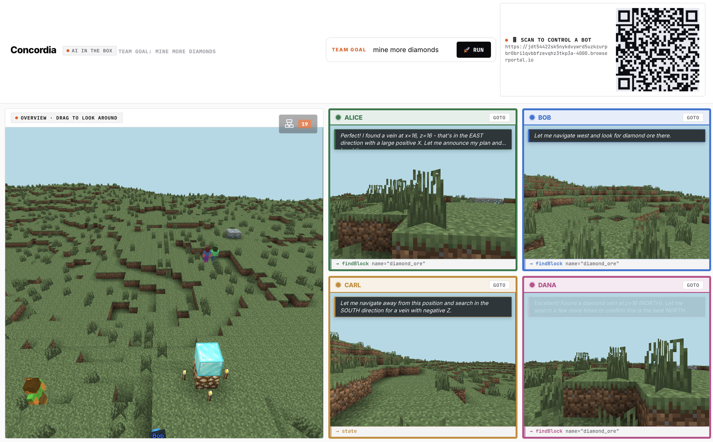
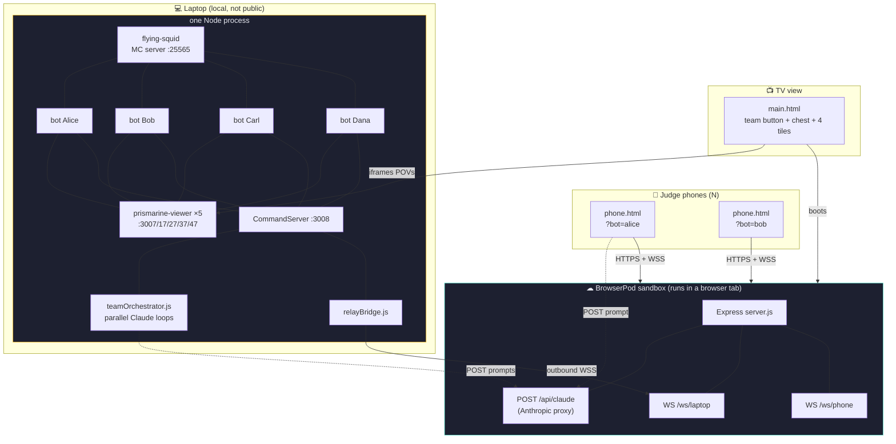
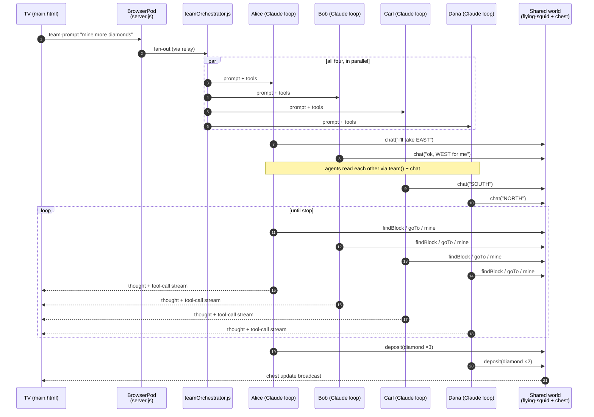
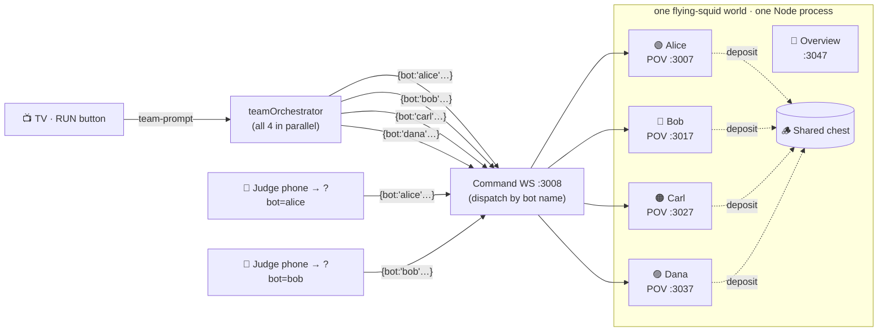

<div align="center">

# Concordia

### **Multi-agent coordination, made watchable.**

*A framework for four Claude-driven agents to plan, negotiate, divide labour, and cooperate in a shared world, where Minecraft is the visualisation layer and the orchestration substrate underneath is the product.*



<sub>Submitted to **AI in the Box** · University of Leeds · 2–3 May 2026 · Built solo in 24 hours.</sub>

</div>

---

## The pitch

> Multi-agent AI is where the frontier is heading. Coordinating, debugging, and *demonstrating* agentic systems is brutal. They fail silently, log opaquely, and have no shared reality for humans to point at.

**Concordia is the playable, observable version of that problem.**

Four agents, each an independent Claude loop with its own tools, memory, and voice, share one world. They negotiate goals over chat, split the map by cardinal directions, watch each other's positions and inventories, and deposit loot into a communal chest. You, the observer, see every reasoning step and every tool call rendered as a living, running thing.

Minecraft is the screen. The coordination protocol is the experiment.

---

## Why this matters

Every frontier AI company (Anthropic, OpenAI, Google DeepMind) is trying to ship **agent swarms** (Claude's Computer Use, OpenAI's Operator, DeepMind's Project Astra). Single-agent tool-use is a solved problem. **Multi-agent coordination is not.** That's where the field is stuck, and it's the bottleneck between today's demos and tomorrow's deployed systems.

Concordia contributes five things to that problem:

### 1. A minimal coordination protocol that actually produces coordination

`team()` (read siblings) + `chat()` (broadcast intent) + `deposit()` (share results). Three primitives. No central orchestrator dictating roles. Four agents reading each other's state and talking in natural language split the map into cardinal quarters on their own. **If three primitives are enough to get emergent division of labour, that's a reusable pattern** for anyone building warehouse robots, clinical-triage agents, or parallel research assistants.

### 2. Human-in-the-loop at *agent granularity*

Most agent systems are binary: fully autonomous, or stop-the-world and prompt the human. Concordia lets a person scan a QR, grab *one* agent, and drive it while the other three keep coordinating around the change. The orchestrator and the human use the **same command bus**. This is the correct supervision model for deployed autonomous systems: selective intervention without pausing the world. I haven't seen it shipped elsewhere.

### 3. Observability as a first-class citizen

You cannot safely deploy what you cannot audit. Concordia surfaces every agent's current thought, current tool call, and current chat line on a shared screen in real time, plus a third-person "god view" over the shared world. **Any team building agent swarms has this exact problem** and ends up staring at JSONL logs. The thought-stream + tool-call + shared-world-view pattern generalises to non-game domains with no modification.

### 4. The substrate is the contribution, not the game

Minecraft is the visualisation layer chosen because it renders spatial coordination legibly. Swap it for:

- a **warehouse** (agents = picking robots, blocks = SKUs, chest = loading bay)
- a **hospital triage queue** (agents = intake coordinators, chest = admissions)
- a **trading desk** (agents = per-asset bots, chest = portfolio)
- **legal discovery** (agents = per-document reviewers, chest = case file)

Same `team` / `chat` / `deposit` protocol. Same orchestrator. Same observability UI. **The Minecraft layer is ~800 lines; the coordination substrate underneath is the artifact that ports.**

### 5. Deployable today, not eventually

The entire public surface (HTTPS, WSS relay, Claude API proxy, phone UI) runs **inside a browser tab** via BrowserPod. No VM, no DNS, no TLS cert, no ops. A researcher can clone this, boot the pod, and get four coordinated agents running for anyone who scans the QR, on battery, in a coffee shop, without a cloud account. *"Would it make a meaningful difference if deployed?"* **It is already deployed, every time someone opens the page.** That's the BrowserPod thesis made concrete.

---

## How BrowserPod makes this possible

Concordia's entire **public control plane** lives inside a [BrowserPod](https://browserpod.io) sandbox. That is not decoration: without it, demoing four coordinated agents to N judges over a locked university Wi-Fi network would have required a VM, a domain, a TLS certificate, a deploy pipeline, and an API-key secret store. With BrowserPod, it required `npm install && node server.js`, running in a tab.

### What runs inside the pod

| Component in the pod | What it buys us |
|---|---|
| **Express HTTP server** | Public HTTPS URL at a portal like `*.browserportal.io`, zero deploy infra, zero DNS |
| **WebSocket relay** (`/ws/laptop`, `/ws/phone`) | Inverts connection direction: the laptop dials *out* to the pod, so a closed Wi-Fi network still serves N public phones |
| **Claude API proxy** (`POST /api/claude`) | Anthropic API key stays server-side in the pod, never ships to a phone's browser |
| **Bundled phone UI** (`phone.html` + assets) | Same-origin HTTPS for everything a judge's phone touches. No mixed-content warnings, no CORS, no WSS-over-HTTP pain |

### Why this pairing is specifically interesting

1. **Multi-agent systems need a control plane.** Every deployed agent swarm needs a public endpoint for humans and an API-key vault for the model. BrowserPod collapses both into one Node process in a tab.
2. **Sandboxed execution of AI-touching code.** The judges said it themselves: *"Perfect for running AI-generated code safely in production."* Concordia's entire agent-facing server surface runs inside the WASM sandbox. If an agent tool were to misbehave, it misbehaves inside the pod, not on a production host.
3. **Network-inversion beats NAT.** Demoing on venue Wi-Fi with no inbound port? BrowserPod's portal + outbound relay makes that a non-issue. The laptop never listens on the public internet; the pod does.
4. **The pitch is provable in 60 seconds.** Boot the page, scan the QR on a phone on cellular, drive an agent. No cloud account touched. That's the BrowserPod product thesis, demonstrated live.

### What had to be worked around

Honest accounting, because the judges will ask:

- **`Buffer.isUtf8` is broken** in BrowserPod's WASM Node 22. It throws on every WS text frame. The fix was `delete Buffer.isUtf8` before requiring `ws`, which falls back to a JS implementation.
- **IndexedDB chokes on ~24,000 tiny files.** `flying-squid` + `prismarine-viewer`'s combined `node_modules` blow up the pod's virtual filesystem during install. That's why the Minecraft server runs on the laptop instead of in the pod. The pod still hosts everything *public-facing*, which is what matters.
- **COOP/COEP cross-origin-isolation headers** are required for BrowserPod to boot (SharedArrayBuffer). Vite is configured to emit them; Safari's support is incomplete, so the TV view is Chrome-only.

Roughly four of the twenty-four hours went to making `npm install` behave cleanly inside the pod. Now it does.

---

## Multi-agent coordination is the product

| Layer | What's happening | Why it matters |
|---|---|---|
| **Agents** | 4× independent Claude tool-use loops, each with its own colour-tinted skin and nametag | Real separate decision-makers, not one LLM role-playing four |
| **Shared state** | `team` tool: read siblings' positions, inventories, last actions. `deposit`: write to a communal chest | Minimal but sufficient primitives for emergent division of labour |
| **Communication** | In-game `chat`: agents announce plans, claim territory, react to each other | Natural-language protocol *between* models, no orchestrator mediating |
| **Goal dispatch** | *Team mode:* one prompt fans out to all four in parallel. *Individual mode:* a human on a phone drives one agent, the other three keep coordinating around them | Lets humans step into the loop without breaking it |
| **Observability** | Every thought, every tool call, every chat line surfaces on the TV and on each controller's phone in real time | Turns an opaque agent swarm into a *debuggable* one |

### Why Minecraft

Because *a world you can see* is the right debugger for coordination. When Alice says *"I'll take EAST"* and walks east while Bob pivots west, you don't squint at JSON. You just watch. The terrain, the seeded diamond veins, the colour-coded skins, the POV split-screens: all of it exists so that a non-engineer can look at a TV and immediately know whether the agents are actually cooperating or politely talking past each other.

Replace Minecraft with a warehouse, a kitchen, a trading floor, a legal discovery pipeline. Same substrate. That's the whole bet.

---

## What you see in the screenshot

- **Team goal** (top centre): *"mine more diamonds"*, a single natural-language instruction fanned out to all four agents in parallel
- **Overview** (left): third-person orbit of the shared world: Alice, Bob, Carl, Dana visible, plus a pre-seeded diamond vein
- **Four POV tiles** (right): live first-person viewports into each agent, colour-coded (green / blue / amber / pink) to match their in-game skin tint
- **Thought bubbles**: the last utterance from each agent's reasoning trace, streamed as Claude thinks
- **Tool-call footer** on each tile (`→ findBlock name="diamond_ore"`, `→ state`, etc.): the current tool invocation, updated per tick
- **QR code** (top right): BrowserPod portal URL. Any phone scans it to take over any agent

At the moment captured: Alice has announced she found a vein at `x=16, z=16` and is claiming the **EAST** sector; Bob is pivoting **WEST**; Carl has chosen **SOUTH**; Dana has locked on **NORTH**. That four-way split is emergent. Nothing in the prompt told them to quarter the map. They saw `team()`, they read each other's chat, they divided.

---

## The 11 tools

Each agent has the same kit. Coordination is only interesting if everyone's capable of the same moves.

| Tool | Purpose |
|---|---|
| `findBlock` | Locate the nearest block of a named type |
| `goTo` | Pathfind to coordinates |
| `mine` | Break a block |
| `place` | Place a block from inventory |
| `craft` | Craft a recipe |
| `equip` | Equip an item |
| `inventory` | Read own inventory |
| **`chat`** | Speak to the world. **The coordination channel.** |
| **`state`** | Read own position / health / environment |
| **`team`** | Read siblings' positions, inventories, last actions |
| **`deposit`** | Contribute to the shared chest |

The bolded four are what turn a bot into a teammate.

---

## Architecture

### Where the code lives



**Key invariants:**

- All four bots and the MC server run **inside one Node process** on the laptop, connected via in-memory `stream.Duplex` pairs (no TCP loopback, because BrowserPod blocks `127.0.0.1`, and keeping it single-process makes `team()` trivial).
- The laptop's `relayBridge.js` opens an **outbound** WS to the pod's `/ws/laptop`. This inverts connection direction so a closed uni network can still serve N public phones.
- The pod holds the Anthropic API key and proxies calls. The browser never touches it.

### A team goal, step by step

One prompt → four parallel reasoning loops → one shared world.



The cardinal split in steps 6–10 isn't in the prompt. It's what happens when four language models can see each other's state and talk.

### Bot roster: who controls whom



Team mode and individual-drive mode use the **same** command bus. The orchestrator is just another client. That's why a judge can grab one bot while the other three keep working.

---

## Run it locally

**Prereqs:** Node 22+, an Anthropic API key, a BrowserPod API key (free tier).

```bash
# 1. Set keys
echo "ANTHROPIC_API_KEY=sk-ant-..." > .env
echo "VITE_BP_APIKEY=bp1_..." > concordia/host/.env
echo "VITE_ANTHROPIC_API_KEY=sk-ant-..." >> concordia/host/.env

# 2. Install
( cd concordia/server   && npm install )
( cd concordia/host     && npm install )
( cd concordia/pod-host && npm install )

# 3. Boot the laptop side (MC server + 4 bots + prismarine viewers)
( cd concordia/server && node index.js ) &

# 4. Boot the host (Vite dev + bundles pod-host into the page)
( cd concordia/host && npm run dev ) &

# 5. Open in CHROME (Safari's COEP/SharedArrayBuffer support is incomplete):
#    http://localhost:5174/main.html
#
#    The page boots a BrowserPod sandbox, copies pod-host files into it,
#    runs `npm install && node server.js` inside the pod, captures the
#    public portal URL, draws the QR, and POSTs the relay URL to the
#    laptop so the bridge connects.
```

Then either:

- Click **🚀 RUN** on the TV and give the team a goal, or
- Scan the QR with a phone and drive one agent yourself. The other three keep coordinating around you.

---

## Code map

```
concordia/                    ← folder name preserved for git history; project = Concordia
├── server/                     # Minecraft + agent side (runs on laptop)
│   ├── index.js                  orchestrator: flying-squid + 4 bots + viewers
│   ├── bot.js                    makeBot() · duplex pair, mineflayer, tools
│   ├── tools.js                  the 11 bot tools
│   ├── commands.js               WS command server + HTTP endpoints
│   ├── teamOrchestrator.js       Claude tool-use loops for ALL bots in parallel
│   ├── relayBridge.js            outbound WS dialer to pod portal
│   ├── duplexPair.js             in-memory socket pair (no TCP loopback)
│   └── worldSetup.js             seedWorld() · plaza + exposed diamond veins
├── host/                       # TV view + phone bundle source
│   ├── main.html                 TV view
│   ├── phone.html                per-agent control surface
│   ├── src/main-screen.js        team button + chest + bot tile grid
│   ├── src/phone.js              per-bot Claude pipeline + UI
│   ├── src/bootPod.js            BrowserPod orchestrator + file staging
│   └── src/claude.js             tool-use loop (browser-side)
└── pod-host/                   # Code that runs INSIDE the BrowserPod sandbox
    ├── server.js                 Express + ws relay + Claude proxy
    └── public/                   bundled phone.html + assets
```

---

## Notes from the build

- Each agent's Steve skin is tinted via a small patch to `prismarine-viewer`'s bundled renderer, using multiplicative `material.color` plus a per-agent nametag sprite so you can tell them apart on the overview.
- Fixed seed (`42424242`) means the world is reproducible across restarts, which matters when you're demoing live.
- The MC server runs on the laptop (not in the pod) for reasons covered in *How BrowserPod makes this possible → What had to be worked around*. Everything public-facing still lives in the pod.

## License

MIT.
